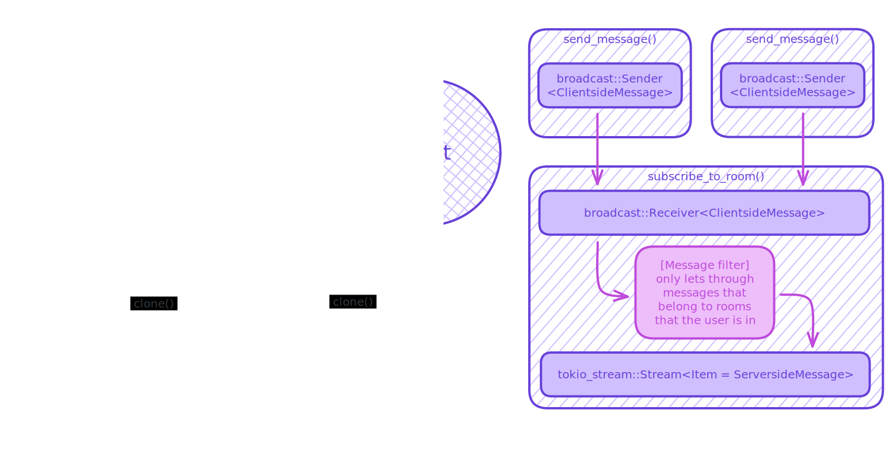

# Архитектура


# Асинхронная диаграмма сервера (In progress)



# Локальная сборка и развертывание сервера

### С помощью Docker

> [!TIP]
> Это наиболее разумный способ развертывания. Остальные приведены для справки.

```bash
# Собрать только контейнер с сервером.
cd server && docker build . -t tcp-chat

# Поднять всю серверную часть. (БД, прогон конверсий, сервер, pgAdmin)
docker compose up --detach --build server sqlrunner

# Просмотр логов.
docker compose logs --follow
docker compose logs <service> --follow # Логи конкретного сервиса.

# Shutdown серверной части.
docker compose down
```

### Без контейнеризации

Установить `cargo` - официальную систему сборки Rust через [`rustup`](https://rustup.rs/).

```bash
curl --proto '=https' --tlsv1.2 -sSf https://sh.rustup.rs | sh # Установка Rust.

cargo build --release # Сборка сервера.
cargo run --release   # Запуск сервера.
cargo clippy          # Линтер.
```

> [!IMPORTANT]
> В системе необходим [`protoc`](https://grpc.io/docs/protoc-installation/)!

### С помощью Nix

```bash
nix build . # Ага, вот так просто.
```
