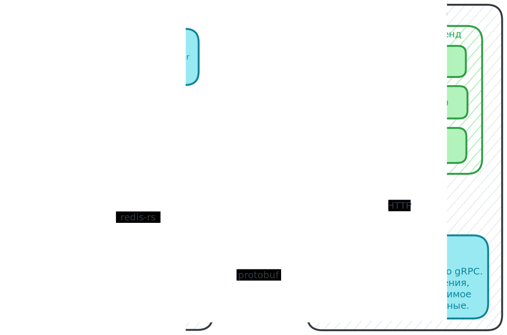

# Кейс 3. TCP чат-сервер и клиент

> [!IMPORTANT]
> Команда ***Бадибилдинг*** (участники и роли в команде)
> [`mxxntype`](https://github.com/mxxntype) (Капитан) -  Rust-сервер, контейнеризация, шифрование и безопасность серверной архитектуры
> [`ddlifter`](https://github.com/ddlifter) - Go-клиент, фронтенд, тестирование, CI-процесс
> [`Sharker5854`](https://github.com/Sharker5854) - Фронтенд, тестирование, Redis, проектирование БД, шифрование и безопасность транспортного уровня
> [`KlausReinherz`](https://github.com/DmitryLebovski) - Фронтенд, дизайн, тестирование, модель машинного обучения
> [`ZarevskyMan`](https://github.com/ZarevskyMan) - Фронтенд, дизайн, тестирование

Цифровая коммуникация становится всё более важной частью нашей повседневной жизни и профессиональной деятельности, эффективные и безопасные средства общения приобретают особую значимость. Этот проект призван разработать систему мгновенного обмена сообщениями, основанную на надежном и простом в реализации протоколе TCP. Проект охватывает создание как серверной, так и клиентской части, обеспечивая асинхронный обмен текстовыми сообщениями и управляющими командами между пользователями. Вам необходимо создать масштабируемый и отзывчивый сервис для коммуникации, который можно будет использовать в корпоративных сетях, образовательных учреждениях или для личных нужд, гарантируя при этом безопасность обмена данными и удобство использования. Разработанная система должна поддерживать множество одновременных подключений, предлагать функции аутентификации, шифрования сообщений и управления соединениями, чтобы предотвратить потерю данных и защитить пользователей от несанкционированного доступа.

#### 1. Фронтенд-разработка:

- [x] Создание современного веб-интерфейса, который предоставляет пользователям интуитивно понятный и визуально привлекательный способ взаимодействия с основными функциями приложения;
- [x] Разработка адаптивного дизайна, который корректно отображается на различных устройствах и платформах;
- [x] Интеграция динамических элементов интерфейса, таких как интерактивные формы, анимации и переходы, для обеспечения высокого уровня вовлеченности пользователей.

#### 2. Применение машинного обучения:

- [x] Разработка модели машинного обучения для анализа поведения пользователей и их предпочтений на основе собранных данных. Эта модель должна предоставлять рекомендации по улучшению пользовательского опыта в реальном времени;
- [x] Внедрение системы предиктивного анализа, которая антиципирует запросы пользователей и предлагает соответствующий контент или услуги, даже прежде чем пользователь выразит свое желание.

#### 3. Разработка протокола коммуникации:

- [x] Определение и реализация простого протокола на основе TCP для обмена сообщениями между клиентом и сервером. Протокол должен поддерживать отправку и получение текстовых сообщений, а также управляющие команды (например, для авторизации или выхода из чата).

#### 4. Сервер:

- [x] Реализация серверной части, способной принимать подключения от множества клиентов одновременно;
- [x] Сервер должен поддерживать рассылку сообщений от одного клиента всем остальным подключенным клиентам;
- [x] Обработка подключений и сообщений должна осуществляться асинхронно или в многопоточном режиме для обеспечения масштабируемости и отзывчивости.

#### 5. Клиент:

- [x] Создание клиентского приложения с текстовым интерфейсом для подключения к серверу и обмена сообщениями;
- [x] Реализация функционала для ввода и отправки сообщений, а также отображения сообщений от других пользователей в реальном времени.

#### 6. Управление соединениями:

- [x] Разработка механизмов для корректного управления подключениями, включая обработку разрывов соединения и корректное закрытие сессий как на стороне сервера, так и на стороне клиента.

#### 7. Безопасность и аутентификация:

- [x] Внедрение простейшей системы аутентификации для пользователей при подключении к серверу;
- [x] Обеспечение базовой безопасности передачи данных, например, через использование шифрования соединения, если это возможно в рамках ограниченного времени.

#### Дополнительные задачи (по желанию):

- [x] Создание дополнительных инструментов аналитики для администраторов, позволяющих отслеживать активность пользователей и эффективность рекомендательной системы;
- [x] Разработка мобильной версии приложения с использованием React Native или Flutter для расширения доступности сервиса;
- [x] Внедрение продвинутых мер безопасности для защиты данных пользователей и обеспечения конфиденциальности их персональной информации.

# Архитектура



# Асинхронная диаграмма сервера (In progress)


# Локальная сборка и развертывание серверной части

### С помощью Docker

> [!TIP]
> Это наиболее разумный способ развертывания. Остальные приведены для справки.

```bash
# Собрать только контейнер с сервером.
cd server && docker build . -t tcp-chat

# Поднять всю серверную часть. (БД, прогон конверсий, сервер, pgAdmin)
docker compose up --detach --build

# Просмотр логов.
docker compose logs --follow
docker compose logs <service> --follow # Логи конкретного сервиса.

# Shutdown серверной части.
docker compose down
```

### Без контейнеризации

Установить `cargo` - официальную систему сборки Rust через [`rustup`](https://rustup.rs/).

```bash
curl --proto '=https' --tlsv1.2 -sSf https://sh.rustup.rs | sh # Установка Rust.

cargo build --release # Сборка сервера.
cargo run --release   # Запуск сервера.
cargo clippy          # Линтер.
```

> [!IMPORTANT]
> В системе необходим [`protoc`](https://grpc.io/docs/protoc-installation/)

### С помощью Nix

```bash
nix build . # Ага, вот так просто.
```
